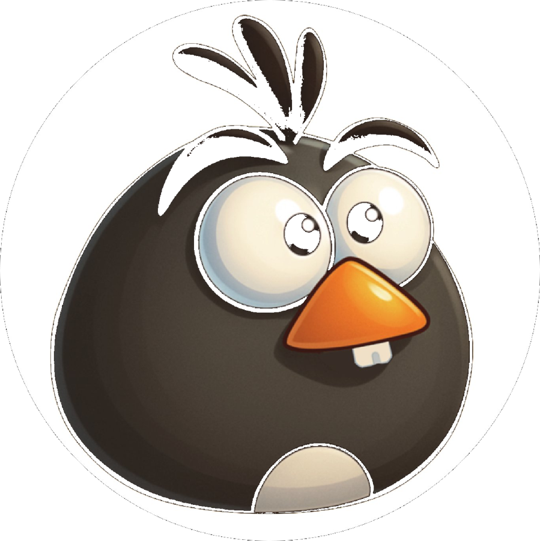
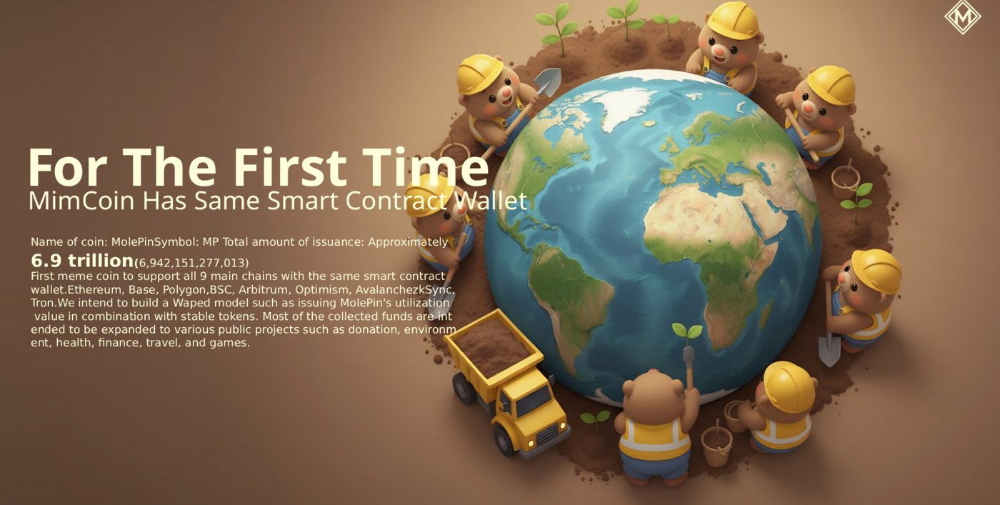

https://github.com/user-attachments/assets/7ccc67f5-58ca-4f8a-bf57-13f7e618d9bf

# MOLEPIN

### The first meme that doesn't bark — it digs.

**Decentralized Web3 ecosystem for location-based engagement, identity, and digital economy.**

`Recovery` · `Contribution` · `Earth` · `Action`

[Website](https://molepin.org) · [X / Twitter](https://x.com/molepinhq) · [Telegram](https://t.me/molepin) · [Medium](https://medium.com/@molepin)

---

## ✦ The Beginning

I didn't choose the mole. **The mole chose me** — in a conversation, in New Jersey, while talking business in New York.

That day, I learned something most people ignore: moles are the silent guardians of the Earth. They don't roar. They dig. They keep soil alive — and in a way, they keep us alive too.

It wasn't just biology. It was destiny. That conversation stayed with me.

So I built **MOLEPIN** — a symbol of the unseen, the essential, and the Earth itself.

And yes, I also remembered that arcade game. Except now, we're not hitting the moles — **we're becoming them.**

▶ 한국어로 보기

 

나는 두더지를 선택하지 않았다. **두더지가 나를 선택했다** — 뉴욕에서 사업 이야기를 나누던 중, 뉴저지에서의 한 대화에서.

그날 나는 대부분의 사람들이 지나치는 사실을 알게 되었다. 두더지는 지구의 조용한 수호자다. 그들은 포효하지 않는다. 그저 판다. 흙을 살아 있게 하고, 어떤 의미에서는 우리를 살아 있게 한다.

그것은 단순한 생물학이 아니었다. 그것은 운명이었다. 그 대화는 내게 남았다.

그래서 나는 **MOLEPIN**을 만들었다 — 보이지 않는 것, 본질적인 것, 그리고 지구 그 자체의 상징을.

그리고 그렇다, 나는 그 오락실 게임도 기억해냈다. 다만 이제 우리는 두더지를 때리지 않는다 — **우리가 두더지가 된다.**

---

## ✦ Why MOLEPIN

I was as confident in my engineering as anyone could be. Drivers, kernels, system devices — domains few dare to touch. For more than sixteen years I built them myself, and turned them into businesses.

But technology alone could not change the world. I took on heavy debt. I watched a company collapse. I missed countless chances and met countless con artists.

And yet — opportunity always arrived through the cracks.

In 2017, when graphics cards were scarce worldwide, a connection with Intel let me supply over 9,000 units, wiring the country's PC rooms together and shifting the tide of the mining market. I went on to create a coin, raise investment, and reach listing — only to lose it all again as COVID and misfortune collided.

What remained was my craft, and a single memory: the ecological importance of the mole, heard one day in New Jersey. A creature that quietly protects life underground. Unnoticed by everyone — yet without it, the ecosystem collapses.

That was me. And that was the MOLEPIN I set out to build.

> Not a meme, but a message.
> Not a token, but a declaration.
> A movement for life that began not from technology, but from memory.

▶ 한국어로 보기

 

나는 IT 기술에 누구보다 자신이 있었다. 드라이버, 커널, 시스템 디바이스 — 누구도 쉽게 다루지 못하는 영역에서 16년 넘게 직접 만들고, 사업까지 이어갔다.

하지만 기술만으로 세상을 바꾸긴 어려웠다. 나는 큰 빚을 지기도 했고, 회사가 무너지는 일도 경험했다. 수많은 기회를 놓쳤고, 수많은 사기꾼을 만났다.

그럼에도 불구하고, 기회는 늘 틈 사이에서 찾아왔다.

2017년, 그래픽카드가 전 세계적으로 품귀일 때, 나는 Intel과의 인연 덕분에 9,000장 이상을 공급해 전국 PC방을 연결했고 채굴 시장의 흐름을 바꾸는 경험도 했다. 이후 직접 코인을 만들고, 투자 유치, 상장까지 경험했지만 코로나와 악연이 겹치며 또다시 기회를 잃었다.

그런 내게 남은 건 기술력과… 하나의 기억이었다. 뉴욕 출장 중 뉴저지에서 들었던, 두더지의 생태적 중요성에 대한 이야기. 땅속에서 조용히 생명을 지키는 존재. 아무도 주목하지 않지만, 없으면 생태계가 무너지는 존재.

그게 바로 지금의 나였고, 내가 만들고자 한 MOLEPIN이었다.

> 밈이 아니라 메시지.
> 토큰이 아니라 선언.
> 그리고 기술이 아니라 기억으로부터 시작된 생명 운동.

---

## ✦ The Mole

Some see the world from above the ground. I have long worked the world from beneath it — designing the invisible, refining structures no one could easily handle, boring my own tunnels through collapse and repetition.

Sometimes the tunnels caved in. Sometimes the dig toward the light was lost in chaos. But the deeper you go, the more you feel the life of the Earth.

In such a moment, remembering the mole was no accident.

A creature that digs through the soil yet never reveals itself. A life that keeps the ecosystem in balance, while no one pays it any attention.

That is where MOLEPIN begins. This token is not a meme — **it is a movement.** It is not an object of investment, but a small, deep hand lifting the Earth back up.

▶ 한국어로 보기

 

어떤 이는 땅 위에서 세상을 본다. 나는 오랫동안 땅 아래에서 세계를 다뤄왔다. 보이지 않는 것을 설계하고, 누구도 쉽게 다룰 수 없는 구조를 다듬으며, 무너짐과 반복 속에서도 나만의 터널을 뚫었다.

때로는 터널이 무너졌고, 때로는 빛을 향한 굴착이 혼란 속에 막히기도 했다. 하지만 깊은 곳에 있을수록 땅의 생명을 느끼게 된다.

그런 순간, 내가 두더지를 기억해낸 건 우연이 아니었다.

땅속을 파지만 스스로를 드러내지 않는 존재. 생태계의 균형을 지키되, 누구도 주목하지 않는 생명.

그것이 MOLEPIN의 시작이다. 이 토큰은 밈이 아니다. **움직임이다.** 이건 투자 대상이 아니라 지구를 다시 일으키는 작고 깊은 손길이다.

---

## ✦ The Recovery

Some beginnings end in failure. And some endings carry a new beginning within them.

In the past, I built something that meant a *start*, and gave form to something that symbolized an *end*. But no structure I made could ever follow my essence. I had the help of dozens of people, yet not a single pair of hands could realize what I imagined.

So I went back underground. In a place no one could see, I began to carve myself away again — from the roots.

Eight hours a day, ten months of relentless study made me look back on all I had built — and finally prepared the completion of a craft that was truly mine.

Then one day, a chance arrived to break the boundary between reality and crypto: a **payable crypto Mastercard.** By then, I was already prepared. In 2024, with a single language — **Flutter** — I built countless features and shipped five apps in five months.

Through the time between a start and an end, through the tunnel of failure and darkness, I am now ready to dig into the Earth again, under the name **MOLEPIN.**

▶ 한국어로 보기

 

어떤 시작은 실패로 끝난다. 그리고 어떤 끝은 새로운 시작을 품고 있다.

과거, 나는 시작을 뜻하는 것을 만들었고 끝을 상징하는 것을 구현했다. 하지만 그 어떤 구조도 나의 본질을 따라오지 못했다. 수십 명의 도움을 받았지만 내 생각을 구현할 수 있는 손은 단 하나도 없었다.

나는 다시 땅 밑으로 내려갔다. 눈에 띄지 않는 곳에서, 다시, 뿌리부터 나를 깎아내기 시작했다.

하루 8시간, 열 달간의 반복된 강의는 내가 쌓아왔던 것들을 돌아보게 했고 마침내, 나를 위한 기술의 완성을 준비시켰다.

그러던 어느 날, **'결제 가능한 암호화폐 마스터카드'**라는 현실과 크립토의 경계를 무너뜨릴 기회가 찾아왔다. 그때 나는 이미 준비되어 있었다. 2024년, 나는 단 하나의 언어 — **Flutter** — 만으로 수많은 기능을 구현했고 5개월 동안 5개의 앱을 세상에 보냈다.

시작과 끝 사이의 시간, 실패와 암흑의 터널을 지나 이제 나는 **MOLEPIN**이란 이름으로 다시 지구를 파고들 준비가 되어 있다.

---

## ✦ MOL — Memory of Life & Earth

We seek to restore what was lost. Where the promises of the past were severed, we plant new life. So we connect every prior value into a new ecosystem.

This is not a simple exchange. It is recovery, declaration, and structure.

Our coin is called **MOL.**

It is **Mole.**
It is **Memory Of Life** — the memory of all living things.
And it is **Mind Of Liberation** — the will to set free.

We plant this coin across many chains — not as a single structure, but as the extended roots of a decentralized ecosystem. And at the center of that structure stands a door called **KookminWallet** — not merely a tool, but a choice for the Earth, the beginning of a small movement to save the world.

▶ 한국어로 보기

 

우리는 잃어버린 것을 복원하고자 한다. 과거의 약속이 단절된 그 자리에 새로운 생명을 심고자 한다. 그래서 우리는 모든 이전의 가치를 새로운 생태계로 잇는다.

이것은 단순한 교환이 아니다. 회복이며, 선언이며, 구조이다.

우리의 코인은 **MOL**이라 불린다.

그것은 **Mole**이자,
**Memory Of Life** — 생명의 기억,
그리고 **Mind Of Liberation** — 해방의 의지이다.

우리는 이 코인을 다중 체인 위에 심는다. 단일한 구조가 아닌 탈중앙 생태계의 확장된 뿌리로. 그리고 이 구조의 중심에는 **'국민지갑(KookminWallet)'**이라는 문이 있다. 이 지갑은 단순한 도구가 아니라 지구를 위한 선택이며, 세상을 구하는 작은 움직임의 시작이다.

---

## ✦ The Legend of the Goldenmole

*Episode I — The Cry of the Earth, and the Last Golden Oath*

While humans sang hymns to the stars, a golden civilization breathed deep within the Earth — more radiant than any empire above. **Eldorasia.** A great underground kingdom built by seventeen tribes of golden moles.

They were blind, yet they saw the pulse of the Earth. They were deaf, yet they heard the breath of nature. Wherever their claws tilled the soil, life returned to dead ground, and the forests answered with carpets of rich leaves.

Then war from the surface shattered everything. *The gods were arrogant, humans were greedy, and nature raged.* Machines felled the forests, endless grazing flayed the land's skin, and reckless development collapsed the kingdom's ceiling. Of the seventeen tribes, sixteen vanished without a trace.

At the brink, from the ruins of paradise, a single golden light burst forth — the last great warrior, **Molepin.**

> **Profile — Warrior Molepin**
> - **Form:** dark golden fur like a curtain, harder and brighter than steel
> - **Weapon:** invincible golden claws that pierce a god's shield — the pioneer of the Earth
> - **Power:** resonance that senses and restores the wounds of the planet

Molepin understood: to stop human greed and save the land, there must be an unbreakable *rule* — a *covenant* that cannot be altered. So he gathered the pressure of the deep magma and the souls of his kin, and spun a blue chain that could never be broken — a transparent, immense network the greed of the surface could never touch. **The genesis of the Blockchain.**

> *"People of the surface — do not stand idle before the destruction you have wrought. Now, only those who join this chain carved by my claws shall be saved from the coming catastrophe."*

Molepin chose the willing among humankind as his allies. To those who protect the environment, plant trees, and heal the land, he grants a **golden value** inscribed on the chain. Every participant becomes one of Molepin's allies — a guardian of the Earth.

The small, great warrior now advances toward the surface, breaking rock with hardened pads, cleaving despair with a wedge-shaped head, taking the first step of a vast journey to save the planet.

***The Golden Warrior Molepin: Prologue of the Earth*** has begun.

▶ 한국어로 보기

 

*에피소드 1 — 대지의 비명, 그리고 마지막 황금 서약*

인간들이 하늘의 별을 우러러 찬가를 부를 때, 대지의 깊은 품속에는 인간계의 그 어떤 제국보다 찬란한 황금 문명이 숨 쉬고 있었다. **엘도라시아(Eldorasia).** 17개의 황금 두더지 부족이 이룩한 위대한 땅속 왕국이었다.

그들은 눈이 멀었으나 대지의 맥박을 보았고, 귀가 먹었으나 자연의 숨소리를 들었다. 그들이 발톱으로 흙을 일굴 때마다 죽은 대지에 생명이 깃들었고, 숲은 풍요로운 낙엽의 카펫을 깔아 화답했다.

그러나 지상에서 시작된 전쟁이 모든 것을 산산조각 냈다. *신들은 오만했고, 인간들은 탐욕스러웠으며, 자연은 분노했다.* 거대한 기계들이 숲을 벌목했고, 끝없는 방목은 대지의 가죽을 벗겨냈으며, 과도한 개발은 지하 왕국의 천장을 무너뜨렸다. 17개 부족 중 16개 부족이 흔적도 없이 멸종했다.

멸종의 기로에서, 무너진 낙원의 잔해 속에서 단 하나의 황금빛이 뿜어져 나왔다 — 마지막 위대한 전사, **몰핀(Molepin)**이었다.

> **전사 몰핀 프로필**
> - **외형:** 강철보다 단단하고 빛나는 어두운 황금빛 커튼 같은 털
> - **무기:** 신의 방패를 뚫는 무적의 황금 발톱 — 대지의 개척자
> - **능력:** 지구의 상처(환경 오염)를 감지하고 복원하는 공명력

몰핀은 깨달았다. 인간의 탐욕을 막고 대지를 구하려면, 변하지 않고 조작할 수 없는 강력한 *규율*이자 *동맹의 증표*가 필요하다는 것을. 그는 지하 깊은 곳 마그마의 압력과 동족들의 영혼을 한데 모아 영원히 깨어지지 않는 푸른빛의 사슬을 자아냈다 — 지상의 탐욕이 절대 간섭할 수 없는 투명하고 거대한 네트워크, 바로 **블록체인(Blockchain)의 시초**였다.

> *"지상의 인간들이여, 너희가 저지른 파괴를 방관하지 말라. 이제 내 발톱이 새긴 이 사슬에 동참하는 자만이, 다가올 대재앙에서 구원받을 것이다."*

몰핀은 인간계의 뜻있는 이들을 동맹군으로 선택했다. 환경을 보호하고, 나무를 심고, 대지를 치유하는 자들에게 블록체인에 새겨진 **황금 가치**를 부여한다. 참여자 모두가 몰핀의 동맹군 — 지구의 수호자가 되는 것이다.

작고 위대한 전사 몰핀은 이제 단단한 가죽 패드로 바위를 부수고, 쐐기 모양의 머리로 절망을 헤치며, 지구를 구하기 위한 거대한 여정의 첫발을 내디뎠다.

***황금 전사 몰핀: 대지의 서막***은 이제 시작되었다.

---

## ✦ The Manifesto

The world trades many promises. A coin was once one of them. But some promises went unkept, and some beliefs were never completed into structure.

Then I understood: technology alone cannot restore trust, and economics alone cannot build a community. The strongest asset in the world is not visibility — it is **story, emotion, and cheerful sincerity.**

So I chose:

> **Fandom over fundamentals.**
> **Meme over roadmap.**
> **Conviction over the physical.**

MOLEPIN began that way — not from a shining whitepaper or complex mathematics, but from the quiet sense of mission of one living creature, heard one day in New York.

> ### "MOLEPIN was not born to make you laugh.
> ### It is a meme that moves underground — to dig the world, and to protect the Earth."

**The first meme that doesn't bark — it digs.**
**Molepin is not a joke. It's a quiet revolution.**
**Every click is a dig. Every holder is a root.**

▶ 한국어로 보기

 

세상은 많은 약속을 주고받는다. 코인도 그중 하나였다. 그러나 어떤 약속은 지켜지지 않았고, 어떤 믿음은 구조로 완성되지 못했다.

그 순간, 나는 알게 되었다. 기술만으로는 신뢰를 복원할 수 없고, 경제만으로는 공동체를 만들 수 없다는 것. 세상에 가장 강한 자산은 가시성이 아니라 **이야기와 감정, 그리고 유쾌한 진심**이라는 것.

그래서 나는 선택했다:

> **펀더멘털보다 팬덤.**
> **로드맵보다 밈.**
> **실물보다 신념.**

MOLEPIN은 그렇게 시작되었다 — 빛나는 백서나 복잡한 수학이 아니라, 어느 날 뉴욕에서 듣게 된 한 생명체의 조용한 사명감으로부터.

> ### "MOLEPIN은 웃기기 위해 태어난 게 아니다.
> ### 세상을 파기 위해, 그리고 지구를 지키기 위해 땅속에서 움직이는 밈이다."

**짖지 않는다 — 판다. 최초의 밈.**
**Molepin은 농담이 아니다. 조용한 혁명이다.**
**모든 클릭은 굴착이고, 모든 홀더는 뿌리다.**

---

## ✦ The Ecosystem

We now gather data — not as mere storage, but to build a **base of memory** that can hold the knowledge of the whole Earth. Energy from nature, space from the land, memory from humankind. MOLEPIN burrows into the Earth and becomes a small particle that reconstitutes a new civilization.

| Pillar | What it is |
|---|---|
| **KookminWallet** | Non-custodial multichain wallet — the door to the ecosystem |
| **DEXignation** | ENS-style `.dex` naming service across chains |
| **KookminDaily** | AI-curated media with prediction market & launchpad |
| **MolePin Mini App** | GPS place curation + the whack-a-mole game that mints MOL |

▶ 한국어로 보기

 

우리는 이제 데이터를 모으고자 한다. 그러나 그것은 단지 저장이 아니라 지구 전체의 지식을 담을 **'기억의 기지'**를 세우는 일이다. 에너지는 자연에서, 공간은 땅에서, 기억은 인간으로부터. 그렇게 MOLEPIN은 지구를 파고들며 새로운 문명을 다시 구성하는 작은 입자가 될 것이다.

| 축 | 내용 |
|---|---|
| **KookminWallet** | 비수탁 멀티체인 지갑 — 생태계로 들어가는 문 |
| **DEXignation** | 체인 전반의 ENS형 `.dex` 네이밍 서비스 |
| **KookminDaily** | 예측시장·런치패드를 갖춘 AI 큐레이션 미디어 |
| **MolePin 미니앱** | GPS 장소 큐레이션 + MOL을 발행하는 두더지 게임 |

---

## ✦ Repositories

| Repository | Description |
|---|---|
| [`molepin-v2-verification`](https://github.com/molepin/molepin-v2-verification) | On-chain verification trail for the omnichain token system |
| [`molepin-mccp`](https://github.com/molepin/molepin-mccp) | Multichain control plane (JavaScript) |
| [`molepin-contracts`](https://github.com/molepin/molepin-contracts) | Smart contracts (Solidity) |
| [`molepin-devlog`](https://github.com/molepin/molepin-devlog) | Development log & technical notes |

---

**MOLEPIN** · `Recovery` · `Contribution` · `Earth` · `Action`

*Every click is a dig. Every holder is a root.*

Made with deep digging by **BUKCS PTE. LTD.** · Singapore · roy@bukcs.com

